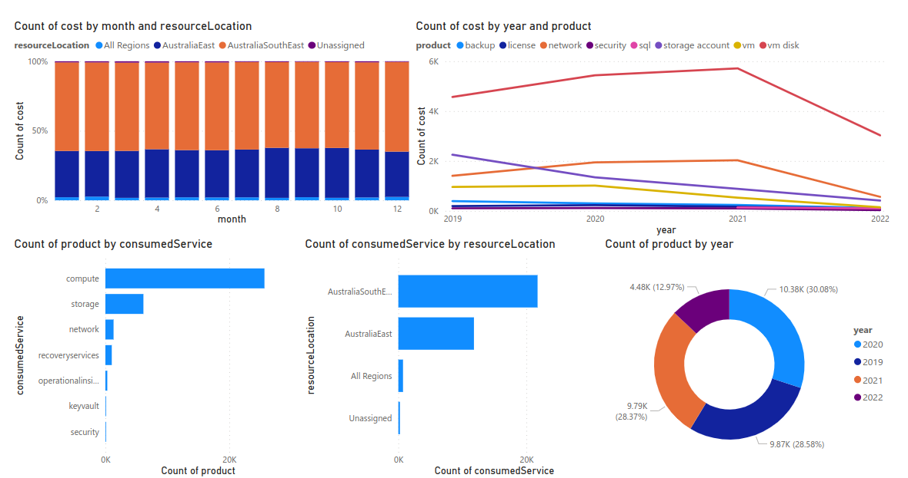

# VICGOV - Azure Reserved Instance
## 1. Introduction
### 1.1	Overview

There is a requirement from the business to further analyze the current cost model for Azure resources and potentially purchase reserved instances.

This document is intended to provide a high level overview of workflow on how the automation fetches data via API and makes dataframe.

Included a step by step detailed analysis notebook around identifying the root cause of the script to fail. (ref: https://github.com/lyoh001/AzureReservedInstance/blob/main/notebook/notebook.ipynb)

## 2 Azure Reserved Instance Power BI Reports
- Description: Fetch and analyze the current cost model for Azure resources via Power BI and Notebook EDA and further predict the cost with ML Time Series. 
- Priority: 3
- Owners: Tier 0

## 3 Logical Architecture
### 3.1	Logical System Component Overview

1. Data gets pulled from Azure cost management REST API to 
Azure Machine learning workspace for EDA and model building.
1. Building EDA report and ML model for Power BI report.
1. Notebook gets pushed to github repository.
1. The end users can consume PowerBI report from any devices.

(ref: https://github.com/lyoh001/AzureReservedInstance/blob/main/.images/dashboard.pdf)

## Used By

This project is used by the following teams:

- Cloud Platform